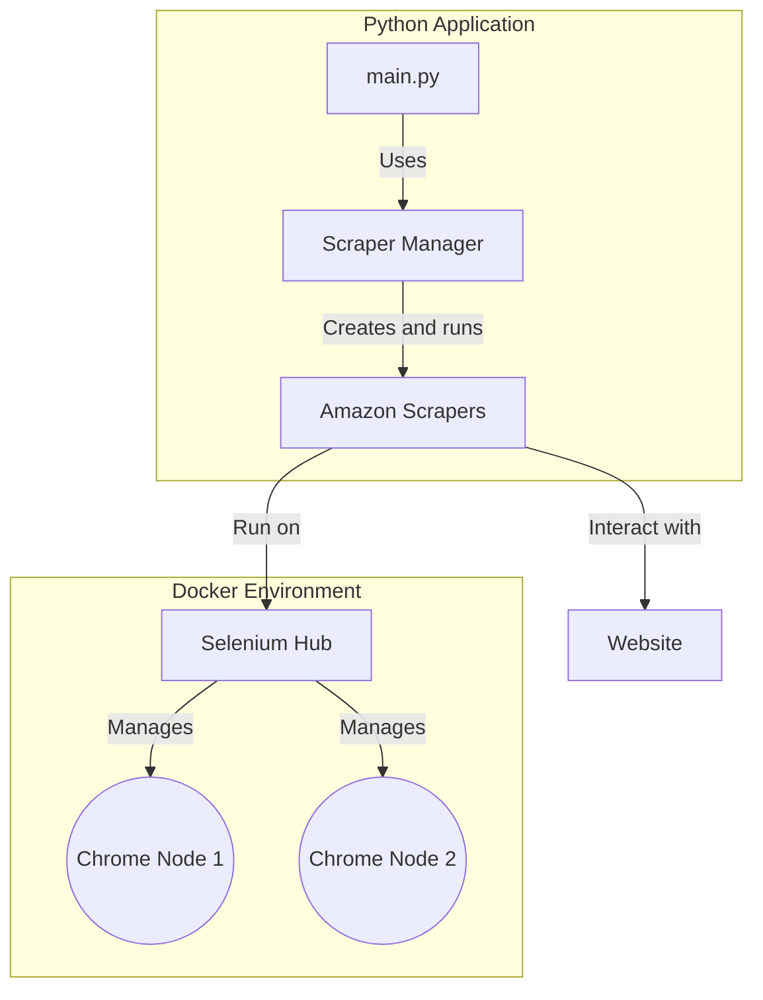

# Amazon Scraper Project

This project is designed to scrape data. It uses a Selenium Grid setup with Docker to run the scrapers in a distributed and scalable manner.

## Requirements

The main requirements for this project are:

- Python 3.8+
- Docker and Docker Compose
- The Python libraries listed in `requirements.txt`:
  - selenium
  - requests
  - bs4
  - python-dotenv

## File Structure

The project has the following file structure:

```
.
├── README.md
├── __init__.py
├── config.py
├── custom_exceptions
│   ├── __init__.py
│   └── auth_exceptions.py
├── docker-compose.yaml
├── main.py
├── requirements.txt
└── scrapers
    ├── __init__.py
    ├── amazon_asin_scraper.py
    ├── amazon_data_scraper.py
    ├── amazon_scraper_manager.py
    ├── amazon_top_scraper.py
    └── base_amazon_scraper.py
```

## Docker Selenium Grid

The `docker-compose.yaml` file is used to set up a Selenium Grid. This allows the scrapers to run in parallel, using multiple Chrome instances.

The grid consists of two main services:

- **selenium-hub:** The central point that receives the test requests and distributes them to the nodes.
- **chrome-1:** A Chrome node that connects to the hub and executes the scraping tasks. The `replicas` attribute is set to 2, which means that two instances of the Chrome node will be created.

To start the Selenium Grid, run the following command:

```bash
docker-compose up -d
```

To stop the grid, run:

```bash
docker-compose down
```

## Project Diagram

The following diagram shows the overall architecture of the project:


